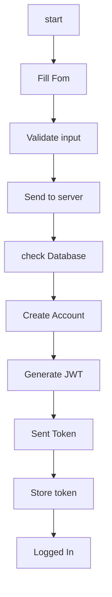
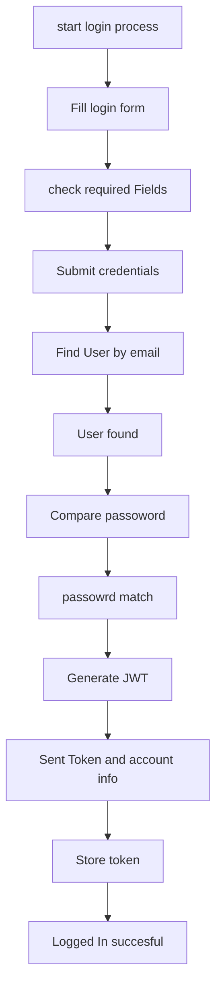

# SIGNUP WORKFLOW
```bash
1. You type your username, email, and password into the signup form.
2. The server makes sure you've filled out everything correctly(password long enough, valid email format). 
3. When you tap "Sign Up," your information is sent to the server. 
4. The server checks its database to see if you username or email is already begin used by someone else. 
5. If everything is good, the server creates a new user account for you.
6. The server generates a JWT (JSON Web Token), which is like a special digital ID card. 
7. The server sends this token back to your app long with some basic info about your account. 
8. The app stores this token on your device using something call AsyncStorage(Like a small cabinet for app data).
9. You're now logged in and can use the app.
```


# LOGIN WORKFLOW
```bash
1. You type your email and password into the login form. 
2. the app makes sure you've filled out all requried fields. 
3. When you tap "Login" you database to find a user with your email address. 
5. If found, the server checks its database to find a user with your email address. 
6. If the passwords match, the server generates a JWT (JSON Web Token), which is like special digital ID card. 
7. The server sends the token back to your app along with some basic infor about your account. 
8. The app stores this token on your device using AsyncStorage(like a small file cabinet app data).
9. You're now logged in and can use the app!
```


